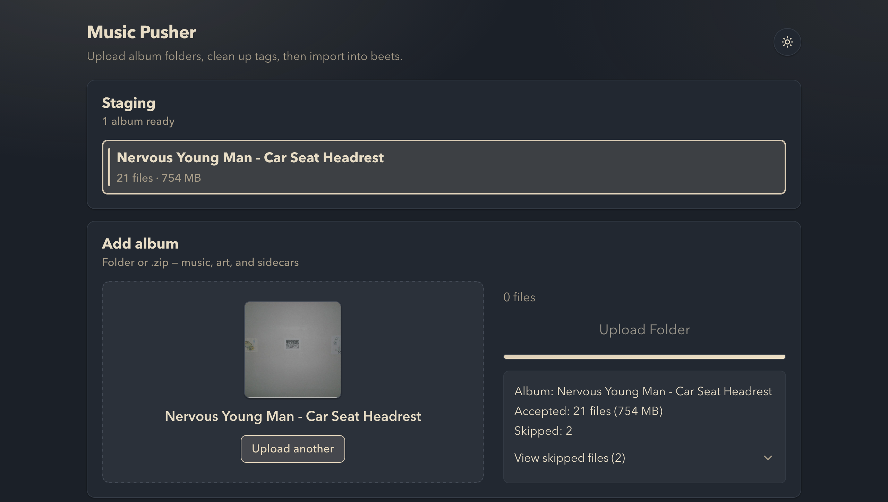
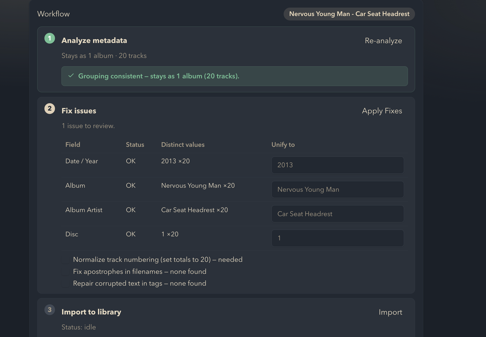

# music-pusher

**A friendly web front-end that glues [beets](https://beets.io) to
[Navidrome](https://www.navidrome.org).** Drop an album folder from any device on
your network, let it catch the tag problems that make players split one album
into several, fix them in place, then `beet import` into the library Navidrome
serves — all while watching the import logs stream live.

> **We didn't reinvent the heavy lifting.** beets does the importing, ffmpeg
> rewrites the tags, exiftool reads them, Navidrome plays them. music-pusher is
> the glue and the UI — the part that was missing, plus every pitfall we already
> hit so you don't have to.





_A walkthrough video is coming soon._

---

## The problem this solves

You self-host your music. You import an album, open Navidrome, and:

- The **one album shows up as three** — split by disc, or by a stray "feat."
  artist, or a release date that differs by one track.
- The **cover art is missing** on half the tracks, even though there's a
  perfectly good `cover.jpg` sitting right there in the folder.
- A track is titled **`Don_t Stop`** because the filename lost its apostrophe.
- The tags contain **invisible control characters** that quietly break sorting
  and search.

All of this is metadata. beets *can* fix it — but you have to know exactly what's
wrong, which field to touch, and how to verify the fix actually collapsed the
album back into one. music-pusher is that missing layer: it **finds the specific
problem, shows it to you, fixes it in place, and re-checks** — from a browser,
including your phone.

## What it is (and isn't)

- ✅ A thin web UI + API that orchestrates tools you already trust.
- ✅ Stateless: **no database, no accounts, no media server of its own.**
- ❌ Not a Navidrome replacement — Navidrome stays your player.
- ❌ Not a beets replacement — your `beets` config still runs the actual import.

## Pitfalls we already hit for you

Each of these is a real symptom we chased down, root-caused, and turned into a
one-click fix:

| You see… | The actual cause | What music-pusher does |
| --- | --- | --- |
| One album split into several | Per-track drift in `album` / `album-artist` / `date`, or unmarked multi-disc structure | Unifies the field to one value, renumbers tracks per disc, then **re-inspects to confirm it collapsed to a single group** |
| Cover art missing on some/all tracks | The image is a loose `cover.jpg` in the folder, never embedded into the audio | Embeds an uploaded image into every track in place with ffmpeg |
| Titles like `Don_t` | Apostrophes mangled in filenames/tags | Repairs the filename and tag text |
| Broken sorting/search | Control-character / invisible-character damage in tag text | Repairs only the text it can confidently recover |
| "Did the fix work?" | No easy way to verify after editing | Every fix re-runs the inspection so you see the album is actually whole |

## How it fits together

```
   Browser (phone / laptop)
            │  upload folder or .zip
            ▼
   ┌──────────────────────┐
   │     music-pusher     │  Node + Express + React
   │  (this repo, the UI) │
   └──────────────────────┘
       │        │        │
   ffprobe   ffmpeg   exiftool      ← inspect / fix / raw dump
       │        │        │
       ▼        ▼        ▼
   ┌──────────────────────┐
   │   RAW staging dir    │  RAW_DIR — where uploads land & get cleaned
   └──────────────────────┘
            │  beet import -A
            ▼
   ┌──────────────────────┐        ┌──────────────────┐
   │   beets library dir  │◀───────│     Navidrome    │
   │ (set in beets config)│  reads │  (your player)   │
   └──────────────────────┘        └──────────────────┘
```

The external tools do the work:

| Tool | Role here | `.env` override |
| --- | --- | --- |
| **[beets](https://beets.io)** | Runs the real import (`beet import -A`) into your library | `BEET_BIN` |
| **[ffprobe](https://ffmpeg.org)** | Reads tags for the inspection report | `FFPROBE_BIN` |
| **[ffmpeg](https://ffmpeg.org)** | Rewrites tags, embeds covers, renumbers tracks, in place | `FFMPEG_BIN` |
| **[exiftool](https://exiftool.org)** | Raw tag dump for a quick eyeball | `EXIFTOOL_BIN` |
| **[Navidrome](https://www.navidrome.org)** | Your player — reads the finished library. Not called by this app. | — |

---

## 1. Install the prerequisites on the host

music-pusher shells out to real binaries, so they must exist on the machine
**before** you start it. On the host:

```bash
# Node.js 18 or newer
node --version

# ffmpeg — provides BOTH ffmpeg and ffprobe
#   Debian/Ubuntu: sudo apt install ffmpeg
#   macOS:         brew install ffmpeg
ffmpeg -version && ffprobe -version

# exiftool
#   Debian/Ubuntu: sudo apt install libimage-exiftool-perl
#   macOS:         brew install exiftool
exiftool -ver

# beets — imports run YOUR beets config, so install and configure it first.
#   A Python venv is the tidy way; note the resulting path for BEET_BIN.
#   python3 -m venv ~/.venvs/beets && ~/.venvs/beets/bin/pip install beets
beet version

# PM2 — the supported way to run it in production
npm install -g pm2
```

> **Configure beets first.** The import writes to whatever `directory:` your
> beets `config.yaml` points at (default `~/.config/beets/config.yaml`). That
> path is the single source of truth for where organized music lands — and it's
> the exact folder you'll point Navidrome at. Set it up and do one manual
> `beet import` by hand before wiring up this app.

## 2. Install the app

```bash
git clone https://github.com/DozenTwelve/music-pusher.git music-pusher
cd music-pusher

npm install              # server deps
npm run client:install   # client deps
npm run build            # builds the React client into client/dist
```

Then run the doctor to confirm the host has everything (it reads your `.env`, so
run it after step 3 to check the *actual* binaries the app will use):

```bash
npm run check
```

It reports exactly what's missing — a bad Node version, an unfound `beet`, an
unwritable `RAW_DIR` — and exits non-zero until the required items pass.

## 3. Configure `.env`

Copy the example and edit it. Every value has a default, but you'll want to set
at least the paths:

```bash
cp .env.example .env
```

```ini
# HTTP port for the API + the built client
PORT=3000

# Where uploads land and get inspected/fixed. This app owns this folder.
RAW_DIR=/home/you/Music/RAW

# Your beets library target — REPORTED on /api/health for a sanity check.
# ⚠️ This does NOT decide where files go. beets' own `directory:` does.
# Set this to the SAME path so health checks stay honest, and point
# Navidrome's music folder at that same path too.
LIBRARY_DIR=/home/you/Music/LIBRARY

# Upload limits
MAX_FILE_SIZE_MB=2048     # per audio file
MAX_ARCHIVE_SIZE_MB=4096  # per uploaded .zip
MAX_FILES=2000            # per upload
MAX_COVER_SIZE_MB=20      # per uploaded cover image

# Absolute paths are safest. If beets lives in a venv, point BEET_BIN at it.
BEET_BIN=/home/you/.venvs/beets/bin/beet
EXIFTOOL_BIN=exiftool
FFMPEG_BIN=ffmpeg
FFPROBE_BIN=ffprobe

# Delete the RAW album folder after a successful import
CLEANUP_RAW_AFTER_IMPORT=true
```

**The one thing people get wrong:** `LIBRARY_DIR` here is only *reported* by the
health check — it doesn't move a single file. The real destination is set in your
beets config's `directory:`. Keep all three in sync:

```
beets config `directory:`   ==   LIBRARY_DIR (.env)   ==   Navidrome music folder
```

Paths support `~` expansion. Full reference:

| Variable | Default | What it does |
| --- | --- | --- |
| `PORT` | `3000` | HTTP port for API + static client. |
| `RAW_DIR` | `./data/RAW` | Staging dir uploads land in. |
| `LIBRARY_DIR` | `./data/LIBRARY` | Reported by `/api/health`; **not** the real import target. |
| `MAX_FILE_SIZE_MB` | `2048` | Per-file upload limit. |
| `MAX_ARCHIVE_SIZE_MB` | `4096` | Per-`.zip` upload limit. |
| `MAX_FILES` | `2000` | Max files per upload. |
| `MAX_COVER_SIZE_MB` | `20` | Max size for an uploaded cover image. |
| `BEET_BIN` | `beet` | Path to the `beet` binary (e.g. a venv path). |
| `EXIFTOOL_BIN` | `exiftool` | Path to `exiftool`. |
| `FFMPEG_BIN` | `ffmpeg` | Path to `ffmpeg` (rewrites tags). |
| `FFPROBE_BIN` | `ffprobe` | Path to `ffprobe` (reads tags). |
| `CLEANUP_RAW_AFTER_IMPORT` | `true` | Remove the RAW album folder after a successful import. |

## 4. Run it with PM2

First start reads `ecosystem.config.js` (process name: `music-pusher`):

```bash
pm2 start ecosystem.config.js
pm2 save            # persist across reboots
pm2 startup         # follow the printed command to enable the boot service
```

Open `http://<host>:3000` — drop an album folder, inspect, fix, import.

### Updating a running instance

```bash
npm run deploy
```

This pulls the latest, reinstalls server + client deps, rebuilds the client, and
`pm2 reload`s the process (zero-downtime). Override the name if yours differs:

```bash
PM2_APP_NAME=my-app npm run deploy
```

### Development (no PM2)

```bash
npm run dev                   # API on :3000
npm --prefix client run dev   # Vite dev server on :5173 (proxies /api to :3000)
```

---

## Run it with Docker (optional)

The app is tiny; its *dependencies* aren't. If you'd rather not install ffmpeg,
exiftool, and beets on the host, the image bundles all three. It's redundant if
your host already has them.

**The image is music-pusher only — it does not bundle a media server.** It
writes the organized library into a shared volume; you point your **existing**
Navidrome at that same volume.

```bash
# 1. beets config — `directory:` MUST be /music
mkdir -p config && cp docker/beets.example.yaml config/config.yaml

# 2. tell it where your library lives on the host (the folder Navidrome reads)
export MUSIC_LIBRARY=/srv/music

# 3. bring up music-pusher
docker compose up -d --build
```

### Where files go (and how the player reaches them)

```
browser upload ──▶ /data/RAW/<album>      (host ./data — you can see it)
        beet import, directory: /music
               ──▶ /music                  (host $MUSIC_LIBRARY)
Navidrome reads ─── /music ◀───────────────┘  same host folder
```

- **Uploads land** in `/data/RAW` = host `./data/RAW`. Removed after a successful
  import (`CLEANUP_RAW_AFTER_IMPORT`).
- **The finished library lands** in `/music` = host `$MUSIC_LIBRARY` (default
  `./library`). This is a **host bind mount, not a named Docker volume** — on
  purpose: a host path is the one thing an external Navidrome can also reach.
- **Two ways the player reaches it:**
  1. *Path* — point your existing Navidrome's music folder at that **same host
     directory** (`$MUSIC_LIBRARY`). A named volume would carry a project prefix
     (`musicpusher_music`) and stay invisible to a Navidrome in another stack;
     the host path avoids that.
  2. *Permissions* — beets writes files as `PUID:PGID`. Navidrome must run as a
     user that can **read** them. Set `PUID`/`PGID` to the user that owns your
     media (ideally the same on both sides), or ensure the files are group/
     world-readable.
- **The same three-way path rule still holds**, at container paths:
  ```
  beets config `directory:`   ==   /music   ==   Navidrome ND_MUSICFOLDER
  ```
- Don't run Navidrome yet? `docker-compose.yml` has a commented-out `navidrome`
  service — uncomment it for a from-scratch demo (adds `:4533`).

The in-image binaries are wired up already (`BEET_BIN=/opt/beets/bin/beet`,
`BEETSDIR=/config`), so you don't set any `*_BIN` paths for the Docker route.

---

## Supported files

- **Audio:** `.mp3 .flac .m4a .aac .wav .ogg .alac`
- **Artwork:** `.jpg .jpeg .png .webp`
- **Sidecars:** `.cue .log .txt .lrc`

Everything else — and system junk like `.DS_Store` — is skipped and reported.

## API

| Method | Route | Purpose |
| --- | --- | --- |
| `GET` | `/api/health` | Liveness + resolved RAW/LIBRARY dirs. |
| `GET` | `/api/preflight` | Host-readiness check (tools + paths); powers the homepage banner. |
| `POST` | `/api/upload` | Multipart folder upload → RAW staging. |
| `GET` | `/api/albums` | List staged albums with size/count. |
| `POST` | `/api/audit` | Run `exiftool -r` on an album (raw dump). |
| `POST` | `/api/inspect` | Structured tag/split/track report. |
| `POST` | `/api/fix` | Apply tag/track/filename fixes in place. |
| `POST` | `/api/cover` | Embed an uploaded cover into every track. |
| `POST` | `/api/import` | Start a `beet import` job. |
| `GET` | `/api/import/:jobId` | Job status. |
| `GET` | `/api/import/:jobId/stream` | Live import logs (SSE). |

## Security note

**There is no authentication.** This app spawns `beet` / `exiftool` / `ffmpeg`,
deletes RAW folders on request, and ships with open CORS. Run it only on a
**trusted LAN** — do not expose it to the internet. If you need remote access,
put it behind a reverse proxy that handles auth (and a VPN is better still).

Built defensively where it counts: path-traversal-checked uploads,
`spawn(..., { shell: false })` everywhere, a single-active-import lock, and
Multer size/count limits.

## License

[MIT](LICENSE)
</content>
</invoke>
